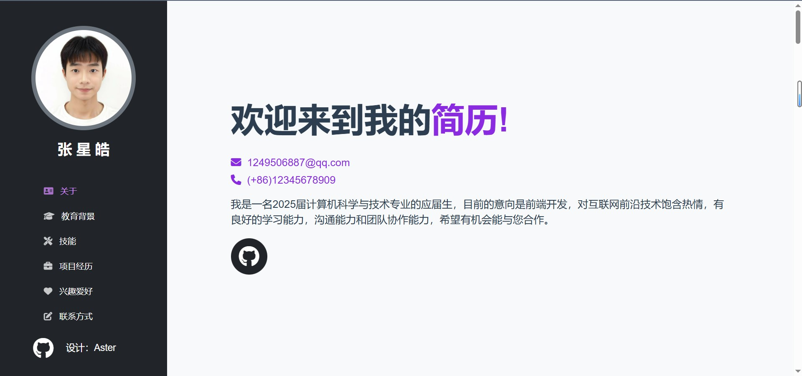
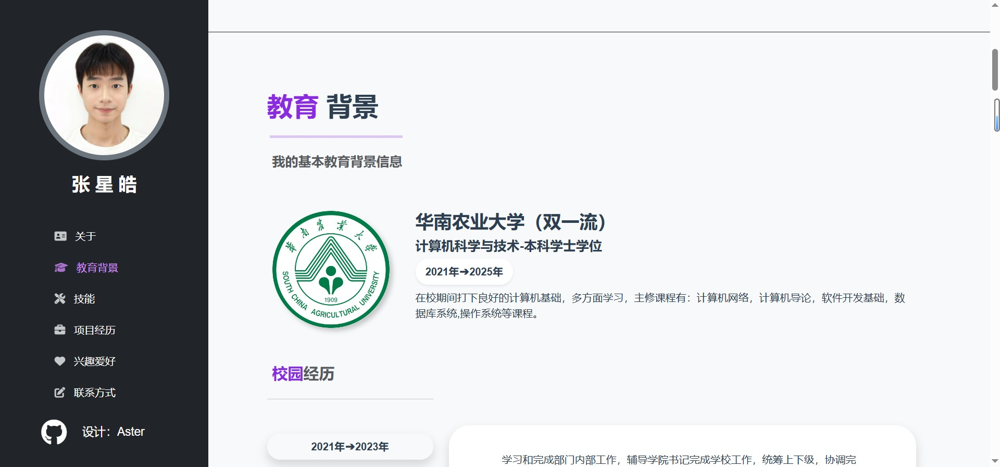
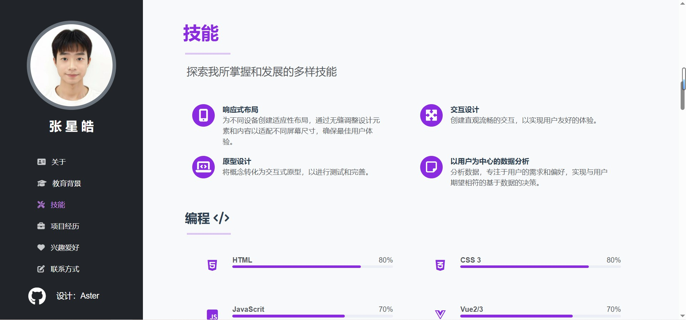
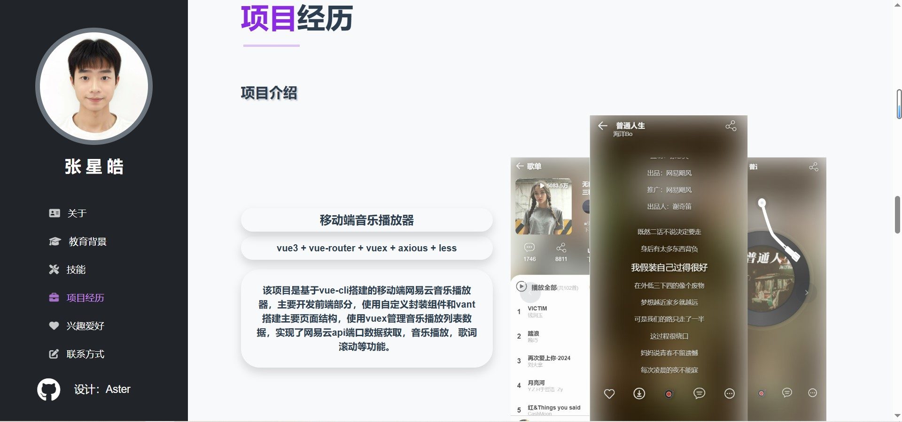
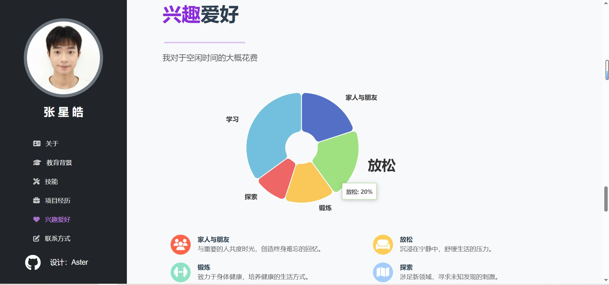

# PersonResume（个人简历展示）
该项目是一个基于 Vue 3 的个人简历网站展示项目，使用了 vue-cli 创建，并结合了 Bootstrap、Element Plus 和 ECharts 来实现网站的布局和功能。（目前还未实现移动端的适配）
点击这里可以查看示例[here](http://8.138.133.94:8888/)
下面是网站页面的展示





## Project setup
```
npm install
```

### Compiles and hot-reloads for development
```
npm run serve
```

### Compiles and minifies for production
```
npm run build
```

### Lints and fixes files
```
npm run lint
```

### Customize configuration
See [Configuration Reference](https://cli.vuejs.org/config/).
